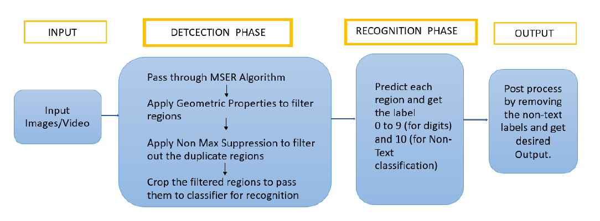

# Street-House-Numbers-Detection-and-Classification

 

👷‍♂️🏗️ Repo Under Construction 🚦⚠️

### OUTLINE
Text detection and recognition in natural images is an important but challenging problem. Because of multiple variations in size, font, location, brightness, it is not a very straightforward to find and recognize text. In this project, I have worked on similar kind of problem using SVHN dataset and then localize and recognize the house numbers in real-world images as output. 

For the interest of learning both detection and recognition from scratch, I have taken two-stage approach in which I have located desired ROIs of the text/numbers using MSER algorithm and further recognize it by implementing a neural network architecture.
In future, I have a plan to execute the same pipeline with one-stage algorithm either using YOLO or SSD and then compare the performance of the two.

